# 大模型核心技术使用原理介绍

本文档核心介绍了大模型面向不同版本的使用场景，提供了目前基于提示工程的大模型的使用方法论。

## 大模型不同版本模型使用方法

### Base 模型

Base模型是大型语言模型的基础版本，具有广泛的语言理解和生成能力。在预训练阶段，模型会从大量无标注文本数据集中学习通用知识。训练目标是模型需要根据提供的文本来预测「下一个单词」。然而，尽管Base LLM在很多方面表现出色，它们仍然存在一些局限性，比如训练数据大多都是来自于互联网、社交平台等易于获取的数据，Base LLM可能会在某些情况下给出不准确或不合适的回答。

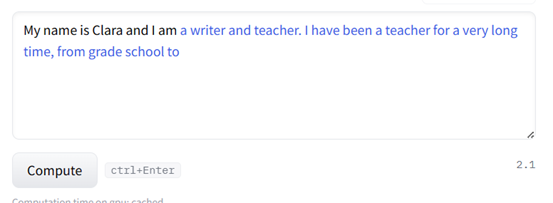

如果使用问句的话，生成效果明显差于续写。

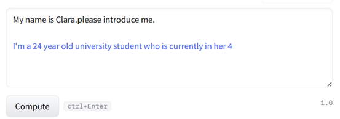
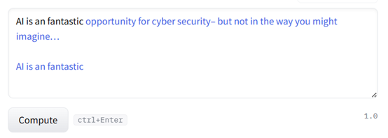
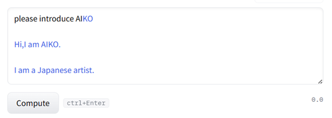

### Instruct 模型

Instruct模型是一种经过专门优化以更好地理解和执行指令的语言模型。它们通过额外的训练和微调，针对特定任务或领域进行了特定的优化。在有监督微调（SFT）阶段，模型会使用人工标注的指令数据集进行训练，其中模型的输入是一个指令（根据任务的不同，也可能包含一段输入文本），输出为模型的预期回复内容。

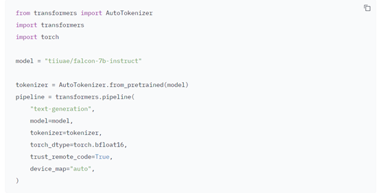
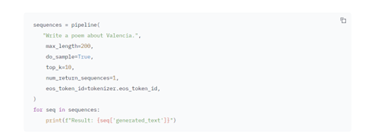
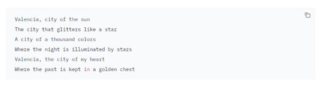
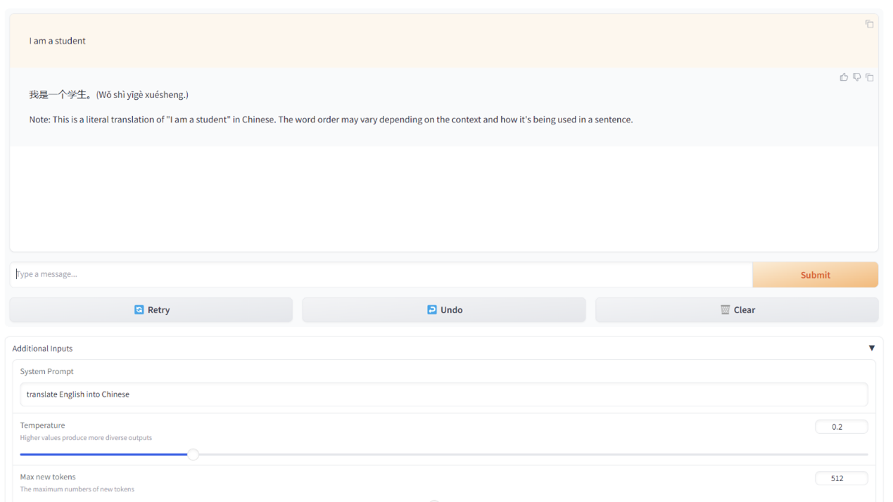
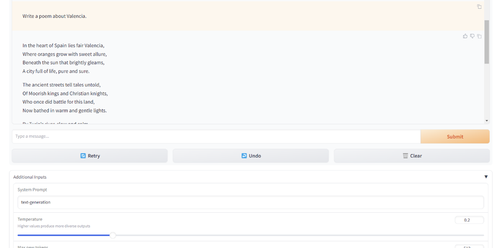

### Chat 模型

Chat模型是在base模型至少使用RLHF微调的模型。在预训练阶段，模型会从大量无标注文本数据集中学习通用知识，然后使用「有监督微调」（SFT）优化模型以更好地遵守特定指令，最后使用对齐技术使LLM可以更有用且更安全地响应用户提示。

ChatML代表聊天标记语言，是一种简单的语言，用于以结构化且人性化的方式声明聊天对话流和自动化。ChatML是一个开放规范。

在system中可以包含以下信息：
A brief description of the assistant
Personality traits of the assistant
Instructions or rules you would like the assistant to follow
Data or information needed for the model, such as relevant questions from an FAQ

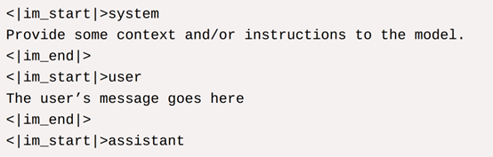

还可以给⼀些额外的instruction，定义模型能够做什么

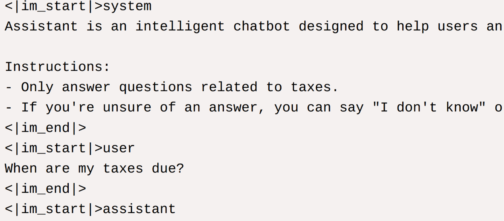

此外，还可以为模型提供额外的上下⽂

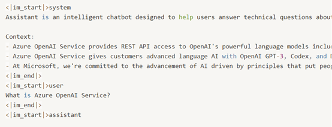

实际运行结果

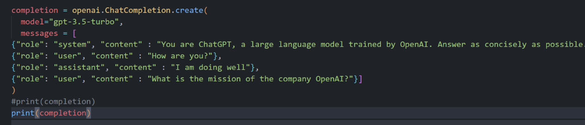
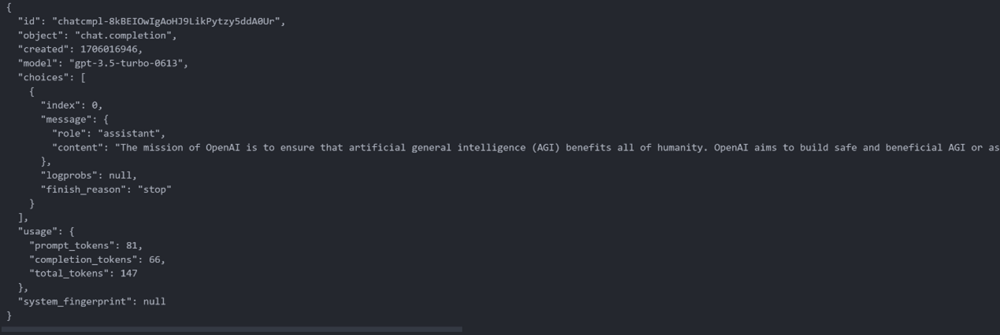

## 基础提示工程

### zero-shot

不向模型提供任何例子

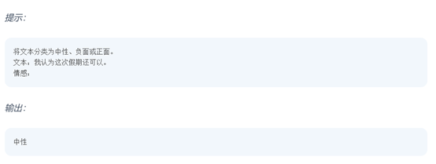

### few-shot

向模型提供一部分例子

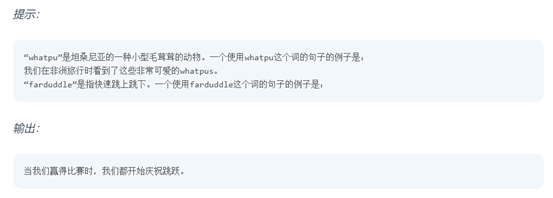

### 生成知识提示

在预测前用于生成知识

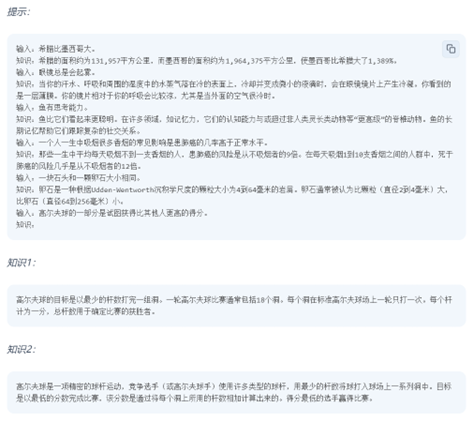

将生成的知识整合，来预测

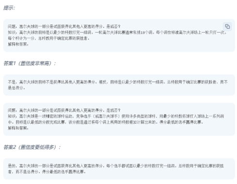

### 思维树

对于需要探索或预判战略的复杂任务来说，传统或简单的提示技巧是不够的。思维树（Tree of Thoughts，ToT）框架基于思维链提示进行了总结，引导语言模型探索把思维作为中间步骤来解决通用问题。

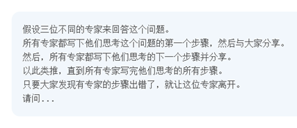

## 大模型系统方法论

**基于提示的大模型使用方法。**

Prompt是一种基于自然语言处理的交互方式，它通过机器对自然语言的解析，实现用户与机器之间的沟通。Prompt主要实现方式是通过建立相应的语料库和语义解析模型，来将自然语言转换为机器可识别的指令。

在大语言模型使用中prompt是用于让大语言模型理解你的问题和需求，大模型会更准确的回答你得问题。

### COT

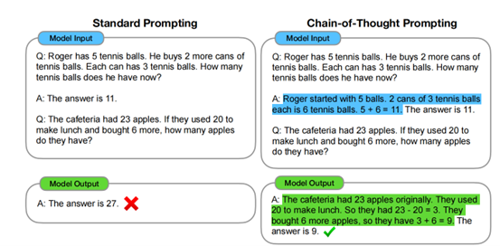

COT目标是赋予语言模型产生一个类似的思维链的能力,利用一系列连贯的中间推理步骤，从而得到一个问题的最终答案。

COT链式思考的特性有：1.思维链原则上允许大模型模型将多步骤问题分解为中间步骤，这意味着额外的计算可以分配给需要更多推理步骤的问题。 2.第二，一连串的思想提供了一个可解释的窗口模型的行为，表明它可能到达一个特定的答案和提供机会调试推理路径出错。第三，思维链推理可以用于诸如数学单词问题、常识推理和符号操作等任务，并且可能适用（至少在原则上）适用于人类可以通过语言解决的任何任务。4.思维链的推理可以在足够大的现成语言模型中引出，只需将思维序列链的例子包括到few-shot提示的例子中。

COT的本质就是将复杂的问题分步骤解决，COT技术已经被证实可以有效提升大模型在推理问题方面的能力。

### RAG

由于模型训练存在使用的知识、数据存在一定的时效性，而RAG能够及时增强大语言模型在实时更新知识、获取训练缺失的领域专业知识等方面的能力。此外，RAG提供了分块功能，可以有效的将长文本分块，将与问题相关的信息以提示的形式交由大模型参考。实现RAG功能主要分为了索引、检索、生成三个步骤

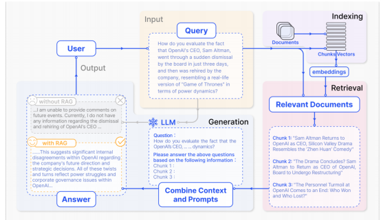

上图为利用RAG功能让大模型回答训练时没有涉及到的相关语料信息。

#### 索引

索引是离线发生时数据准备的关键初始步骤，涉及以下几个阶段。原始数据清理和提取：将各类型数据如PDF、HTML、WORD转化为标准化的纯文本。文本分割：为了适应模型的上下文长度限制，文本被分割成更易于管理的小块。嵌入（Embeddings）：通过嵌入模型转换为向量表示，选择嵌入模型是为了在推理效率和模型大小之间取得平，并且有助于检索阶段进行相似度对比。创建索引：将这些文本块及其向量嵌入存储为键值对（标识-数据的映射关系），这允许高效和可伸缩的搜索功能。

#### 检索

检索是在收到用户查询后，系统使用在索引阶段使用的相同的编码模型进行转码并输入到向量表示法中，计算查询向量和向量数据库向量的相似度，系统对与查询相似最大的前K个块进行优先排序和检索，这些块随后被用作处理用户请求的扩展上下文基础。

#### 生成

所提出的查询和所选择的文档被合成成一个连贯的prompt，大模型负责制定一个相应，模型的回答方法可能根据特定任务的标准而有所不同，允许它利用其固有的参数知识或限制其对所提供文档中包含的信息的响应。在正在进行的对话的情况下，任何现有的对话历史都可以集成到提示符中，使模型能够有效地参与多回合的对话交互。

### ReAct

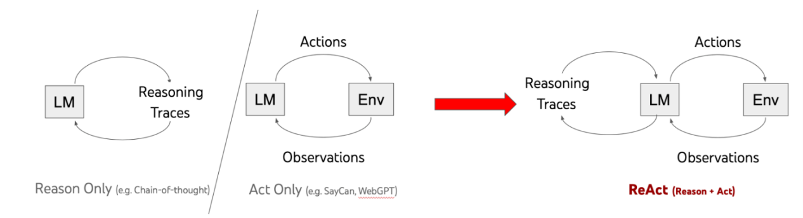

ReAct将思考和行动相结合，显示推理出正确的答案

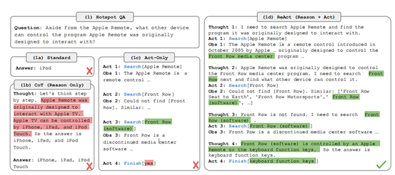

上图为思考+行动与单独思考或行动在完成任务准确上的差别。

#### 思考（Reasoning）

根据已有信息展开思考，确认自己下一步需要调用什么工具来帮助解答问题。

#### 行动（Acting）

调用一些外部工具（知识库、网站等等）去寻找与问题有关的相关背景知识进行推理。

### AI agent

智能体可以感知环境并采取行动。智能体可以从易到难分为简单反射体、基于模型的反射体、基于目标的智能体、基于实用的智能体和强化学习型智能体等类型。强化学习型智能体通过试错学习来最大化累积奖励，但也存在一些局限，如需要大量训练时间、学习效率低下、训练不稳定等。而基于LLM的智能体结合了LLM强大的语言理解和生成能力，结合不错的决策和计划能力，可以弥补强化学习型智能体的不足，是实现通用智能一个非常有潜力的技术路径。基于LLM的智能体可以分为单智能体系统和多智能体系统(MAS)，单智能体系统通常需要处理多个任务和领域。

#### 单智能体

大模型下的单智能体主要包含了：计划、目标、记忆、行动和反思，这5要素分别处理智能体的思维、目标、存储、行动和回顾。

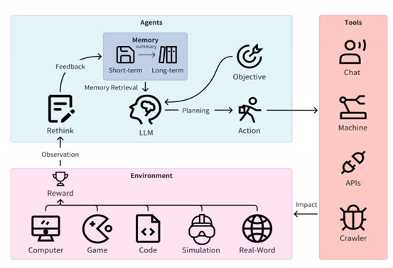

* 计划：大模型针对已有信息选择行动，由于大模型本身就具有规划决策的能力，因此不需要额外的学习策略（例如动态规划算法),通过一些方法还可以增强大模型规划的能力。
* 目标：大模型根据自然语言的问题来理解任务目标，不需要目标函数。
* 记忆：大模型的记忆能力远高于其他智能体，主要功能是保存和调节知识、经验数据和历史信息、用于解决问题和任务执行过程中的参考和修改。此外记忆还表现了当前智能体的状态。
* 行动：大模型可以调用外部工具来达到每一步的目标，实现与外部的交流。
* 反思：大模型具有反思功能，会评估之前的决策和环境产生的反馈，llm是可以彻查其行为、决策和学习过程，以此增强在任务领域的能力和适应性。

#### 多智能体

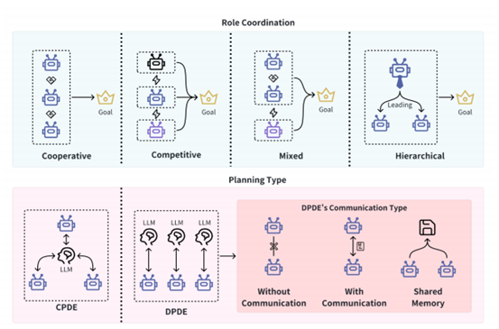

如上图所示多智能体系统适用于需要协作的任务，并且侧重协同和信息交换。智能体之间的关系可以分为四类

* 协作关系：智能体之间进行协作和配合，当前的研究主要集中在角色分配、决策制定等方面。
* 竞争关系：智能体之间存在竞争，当前的研究关注设计有效的竞争策略。
* 混合关系：需要在合作和竞争间找到平衡，重点是设计合作竞争算法。
* 层次关系：采用分层的控制结构,父节点分配任务,子节点执行任务。研究者关注的主要是一些分层控制结构。

此外多智能体计划执行也有两种模式

* 集中计划分布式执行(CPDE)方法是一个中心化的LLM负责为所有智能体计划，考虑所有智能体的目标和约束，生成行动方案。
* 分布式计划分布式执行(DPDE)是每个智能体都有自己的LLM，基于本地信息独立计划，智能体可以通过直接通信等方式进行信息交换和协调。DPDE系统更具可扩展性，但整体最优难以达到，CPDE可全局优化，但计算更复杂。

而未来对于大模型的多智能体系统可利用博弈论、拍卖理论等进行深入探索。

### AutoGen

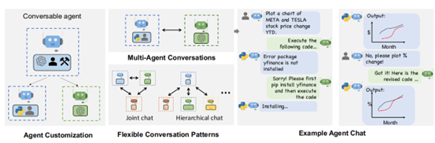

上图展示了，AutoGen可以轻松快速的创建不同角色的智能体，并且这些智能体可以自主接收、反应和响应消息，在一定配置下，智能体之间可以自主的产生多论对话，还可以主动征求人类输入，由此实现了自动化和人类代理。

AutoGen通过对话的形式，首先，增强了LLM作为智能体时的推理能力，并提供了一系列功能（例如，结果缓存、错误处理、消息模板）。其次，AutoGen允许人类通过代表人类的智能体参与对话，并提供人类输入频率或跳过输入选项。最后，AutoGen的用户代理智能体能够执行LLMs建议的代码，或进行LLMs建议的函数调用。
