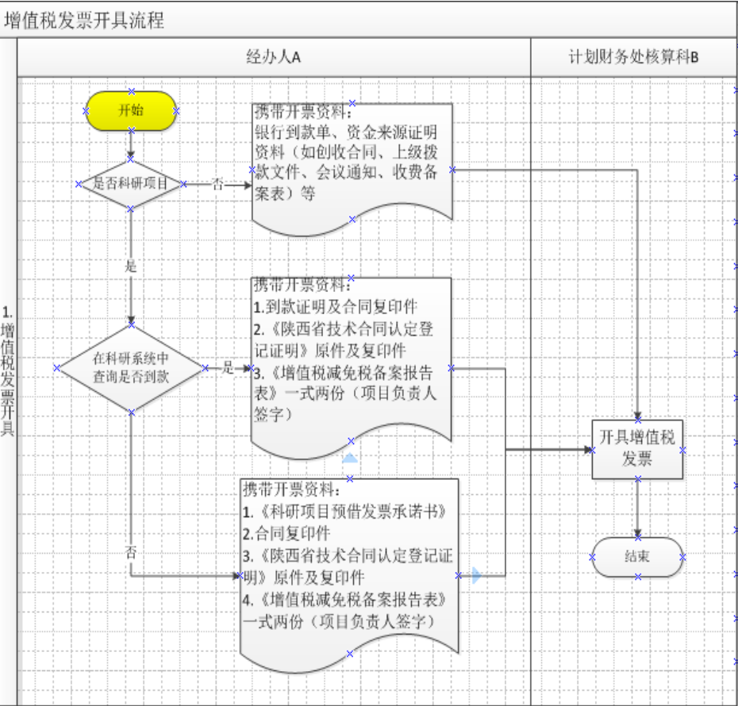
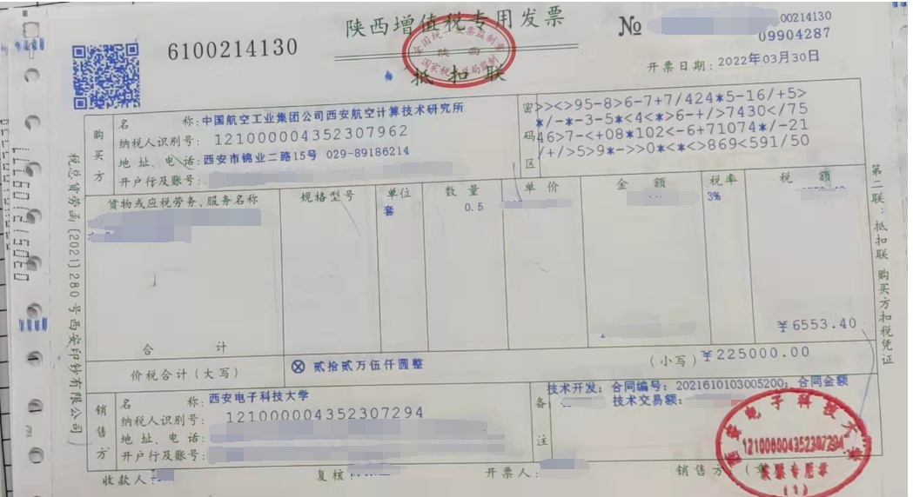
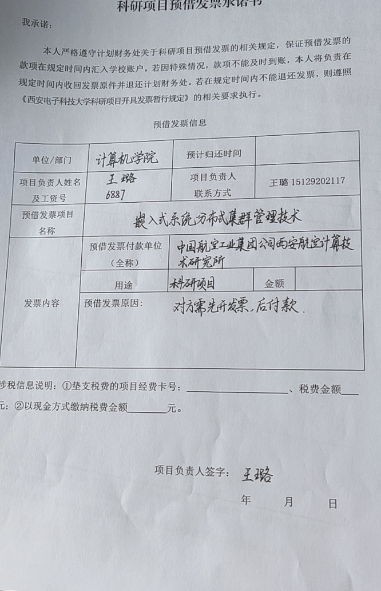
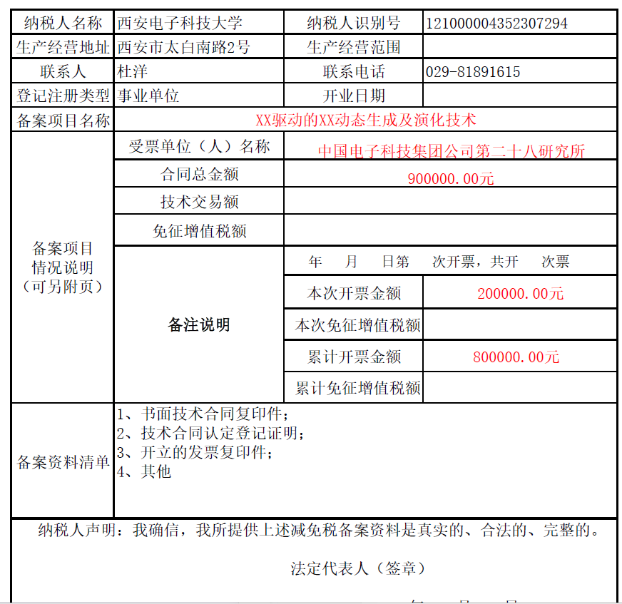
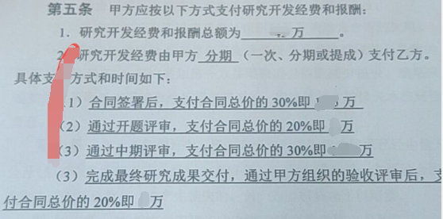

# 预借发票流程

办理位置：南校区班车处，计划财务处靠C楼一侧，开票窗口。

## 前置知识

区分：如果经费没有到账，则为**预借发票**，预借发票分为两类：**普通发票和专用发票**，两者区别在于前者无需交税（在有“技术合同认定证明”情况下），而后者需要从申请表选定的项目经费中扣税。

对于科研项目，提交材料主要分为三个部分：

1. **“技术合同认定登记证明”**，如果没有制作，则需要去“科研院-技术转移中心”（南校区行政楼5楼，[科研院机构设置](https://ord.xidian.edu.cn/gywm/jgsz.htm)）完成相关流程，有问题则可以电话询问对应的工作人员。

   1. 须填写“西安电子科技大学横向科研项目经费预算表”，网上[下载](https://ord.xidian.edu.cn/xzzq/htmbzq.htm)或者去科研院-技术转移中心领取（填写时注意数字计算不要出错）。

   2. 最后结果可以在科研管理系统当中查看，以前带有一张红票，现在只是一张登记证明，完成周期为两周至一个月左右。

2. **“合同”原件与复印件**（元件并不是必须的）

3. **“科研发票承诺书”**(即科研预借发票申请书)和“增值税减免税备案报告表”，两者需要填写具体信息。详细解释如下。[票据相关-西安电子科技大学计划财务处](https://cwc.xidian.edu.cn/list.jsp?urltype=tree.TreeTempUrl&wbtreeid=1282)。最后，在线上填写发票信息时，注意甲方单位的税号不要写错，军方单位无需填写税号。

最后的票据样例：

## 填写示例

**承诺书**示例如下：

注意：

+ 金额：按照甲方要求填写。
+ 预计归还时间：表示这个发票大致的到账时间，需要和老师详细询问，一般不能跨过当年。
+ 垫支税费的项目经费卡号：该项与发票种类有关，如果是普通发票则无需税费，不需要填写，如果是专用发票，则需查看科研系统或直接询问老师。

**备案报告表**示例如下：

注意：

+ 除去基本项目信息的填写外，主要关注“金额”相关内容。从**合同**的说明当中，看“第几次开票”，“累计开票金额”等。“免征税额”等交表时可不必填写。
+ “技术交易额”，是指从合同交易总额中扣除购置设备、仪器、零部件、原材料等非技术性费用后的剩余金额。但合理数量标的物的直接成本不计入非技术性费用；（“技术认定登记声明”上有相关项目，对应填写即可。）
+ “法定负责人”下一栏的“负责人”选项需要填写老师姓名。

合同信息示例如下：


技术认定和预借发票需要多复印几份，留作备份。

