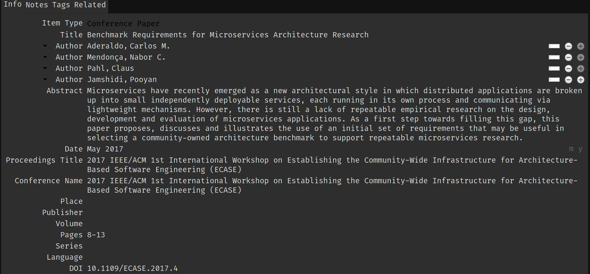
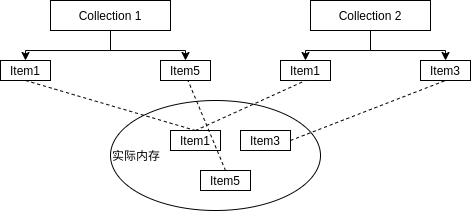
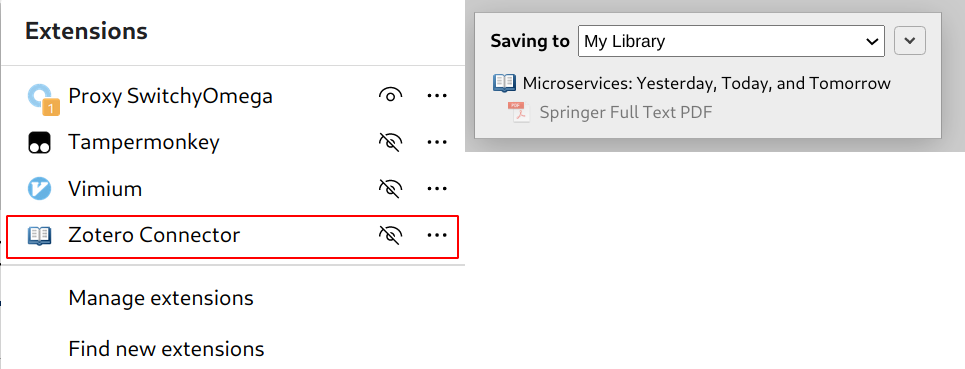
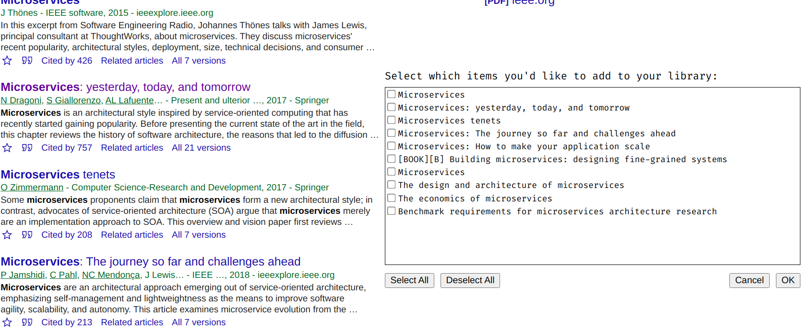
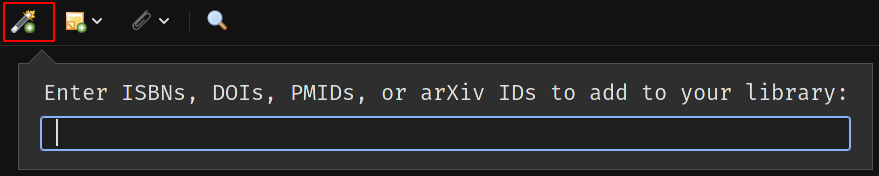
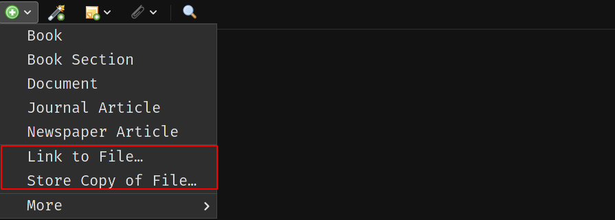

# 文献管理

文献管理是一个相当重要的东西。高效管理你已经获取了的文献，是提高效率的关键。

## 原始管理

最原始的管理方法就是通过文件夹管理了，但这无疑是最为笨拙的方法。你需要每次移动你的文件到指定的目录，需要做很多事情来维护整个文件夹的结构。我们应该关注于内容而不是这些细枝末节。

## Endnote

[Endnote](https://endnote.cn/)是一款专门用于文献管理的软件。然而这是一款付费软件，尽管你可以通过破解软件破解该软件用于正常使用，但我们并不推荐这样做。而且 Endnote 并不开源，所以我们并不推荐这款软件。

## Zotero

[Zotero](https://www.zotero.org/)同样也是一款专门用于文献管理的软件。这是一款免费且开源的软件，适用于 Windows、macos 以及 Linux 三个主流操作系统平台。鉴于其免费且开源，我们推荐使用该软件作为文献管理的工具。

对于其具体的使用，你需要参考[官方文档](https://www.zotero.org/support/)。

### 安装

参考[官网教程](https://www.zotero.org/support/installation)

### 基本概念定义

#### Item

在 Zotero 中存在着许多概念，这些概念在本质上都是基于 Item 概念的基础上定义的。官方文档给出的 Item 的定义如下所示：

> Every item contains different metadata, depending on what type it is. Items can be everything from books, articles, and reports to web pages, artwork, films, letters, manuscripts, sound recordings, bills, cases, or statutes, among many others.

从官方文档的定义可以看出，Item 就是一个结构体变量，包含了不同的元数据，如下图所示。

```c
struct Item {
    ...
};
```



#### Collection

音乐播放器的播放列表通常可以创建多个音乐列表，每个音乐列表可以包含不同的音乐。Collection 的作用正如同播放列表一样，用于组织 Item，如下图所示。



#### Tag

Tag 的含义很好理解，就是标签，另一种组织 Item 的方式。

### 添加 Item

本部分阐述添加 Item 的方法。

#### 通过浏览器

首先需要在浏览器安装插件 Zotero Connector。

假设找到了一篇文献[Microservices: Yesterday, Today, and Tomorrow](https://link.springer.com/chapter/10.1007/978-3-319-67425-4_12)。打开网页后，使用插件直接添加 Item，如下图所示。



同时 Zotero 还支持添加通用的网页和 PDF 文件作为 Item，此处不赘述，还有一种情况就是当 Zotero 遇到某些网页含有多个 Item 的信息后，会弹出复选框进行选择，如下图所示。



#### 通过标识符

Zotero 同时支持通过标识符直接添加 Item。可以添加以下的标识符：

* [ISBN](https://en.wikipedia.org/wiki/International_Standard_Book_Number)
* [DOI](https://en.wikipedia.org/wiki/Digital_object_identifier)
* [PubMed ID](https://en.wikipedia.org/wiki/PubMed)
* [arXiv ID](https://en.wikipedia.org/wiki/ArXiv)



### 添加文件

文件可以作为一个单独的 Item，也可以作为已经存在的 Item 的子 Item。例如当存储一个 PDF 文件至 Zotero 时，Zotero 会尝试[获取该 PDF 文件的元数据](https://www.zotero.org/support/retrieve_pdf_metadata)并自动创建其父 Item。如果无法识别其元数据，该 PDF 文件将会作为一个单独的 Item 存在。

Zotero 的文件可以作为两种方式管理：

* 实际文件：存储在[Zotero data directory](https://www.zotero.org/support/zotero_data)。
* 链接文件：存储文件在磁盘中的位置。

#### 通过浏览器添加

当 Zotero 通过浏览器添加 Item 时，Zotero Connector 会自动识别与该 Item 相关的网页快照和 PDF 文件，保存的网页快照和 PDF 文件将会作为实际文件保存到 Zotero data directory 中。

#### 通过 Zotero 软件添加

直接拖拽到相应的 Item 中即可，默认将会直接复制原文件至 Zotero data directory 中，如果需要使用链接文件，在拖拽的使用，按住如下按键：

* Windows/Linux：`Ctrl+Shift`
* macOS: `Cmd+Option`

也可以直接通过按钮添加文件，如下图所示：



### RSS 订阅

Zotero 也可以添加 RSS 订阅：

* URL
* [OPML](https://en.wikipedia.org/wiki/OPML)

### 管理 Item

直接通过按钮添加 Collection，如下图所示。至于如何添加/移除 Item 到 Collection、重命名 Collection 以及删除 Collection 的操作此处不赘述。


在 Zotero 中有几个特殊的 Collection：

* `My Publications`：顾名思义。
* `Duplicate Items`：多余的 Item，如何对其操作请参考官方文档。
* `Unfiled Items`：包含没在任何一个 Collection 的 Items。（~~无家可归的幽魂~~）
* `Trash`：顾名思义。

### 同步与备份

#### 同步

Zotero 的同步分为了两个类型：

* 数据同步：可以直接使用 Zotero 提供的同步服务，免费且方便，创建一个 Zotero 的账户即可。
* 文件同步

文件同步相对来说要复杂一下，首先是实际文件的同步。Zotero 提供了对实际文件同步的功能，这一部分采取的是订阅制，免费用户可用的同步空间是 300M。

当然也可以使用替代方案，通过 WebDAV 实现同步。目前国内比较好用的 WebDAV 也就只有坚果云了，目前使用坚果云实现同步的教程较多，此处不赘述。

除了对实际文件的同步以外，也可以进行对链接文件的同步，其本质的思路是在不同的主机上保存不同的文件链接。

#### 备份

在 Zotero data directory 中最重要的文件是`zotero.sqlite`，同时也包含了目录 storage，该目录主要是附件内容。

备份只需要对 Zotero data directory 进行备份即可，至于其他的备份方法，参考官方文档。

### 可供参考资料

本教程几乎没有对细节的问题进行阐述，例如如何使用坚果云及其他国外支持 WebDAV 的网盘实现实际文件的同步、标签的具体使用、参考文献的导出和第三方插件的使用等问题。本教程着重点在于给读者对该软件有一个大方向的认识。因此在本教程的最后列出官网以及其他教程的参考资料供读者解决某些实际问题。（~~没有必要重复造轮子~~）

* [Zotero 官网参考资料](https://www.zotero.org/support/)
* [坚果云使用 Zotero 配置过程详解](https://help.jianguoyun.com/?p=4190)
* [Zotero 教程入门六篇](https://www.douban.com/group/topic/79928493/)
* [知识管理软件 Zotero 的使用](https://zhuanlan.zhihu.com/p/26765443)


当然，你可以去尝试其它不同类型的文献管理工具，适合自己的才是最好的。

