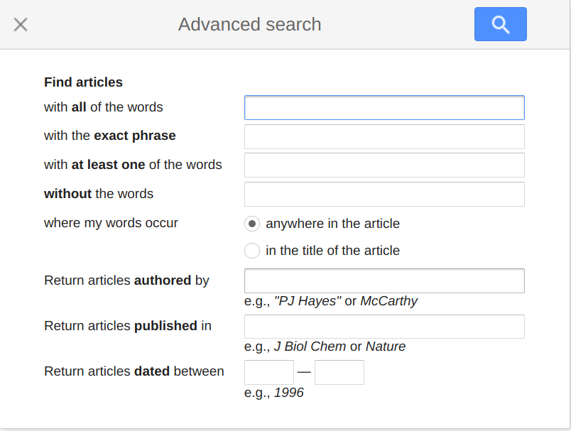
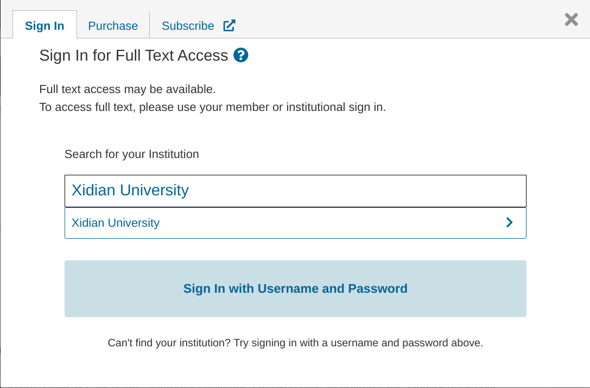

# 文献搜索

文献的搜索有很多种方式，但是最关键的问题是你要学会科学上网，使用 Google Scholar。

## 文献检索

* 查询国际会议、期刊论文：[wikiCFP](http://www.wikicfp.com/cfp/)。
* 查询 EI 检索的论文：[EI](https://www.engineeringvillage.com/search/quick.url)
* 查询 SCI 检索的论文： [SCI](https://www.webofscience.com/wos/alldb/basic-search)
* 查看国内计算机学会活动: [CCF](http://www.ccf.org.cn)

实际上，在哪个网站去做文献检索都是可以的，你可以选择你认为合适的去做检索，但关键在于如何提高检索的效率，每一个检索的网站都会为检索者提供相应的被称为**高级搜索**的功能，通过高级搜索通常会提高你的检索效率。这一部分将在 Google Scholar 处进行进一步的讨论。

你可以下载下方的 Word 文档看具体的细节。

[查询方法和链接-期刊、会议、论文、影响因子](http://8.141.51.55:8000/EssayResources/%E6%9F%A5%E8%AF%A2%E6%96%B9%E6%B3%95%E5%92%8C%E9%93%BE%E6%8E%A5-%E6%9C%9F%E5%88%8A%E3%80%81%E4%BC%9A%E8%AE%AE%E3%80%81%E8%AE%BA%E6%96%87%E3%80%81%E5%BD%B1%E5%93%8D%E5%9B%A0%E5%AD%90.docx)

### 百度学术检索

你可以直接通过[百度学术](https://xueshu.baidu.com/)进行论文的检索。

### 谷歌学术检索

实际上，[谷歌学术](https://scholar.google.com/)检索应该作为你检索的重心。高级检索很简单，如下图所示。

## 文献获取

文献检索只做了一个事情，就是获取这个文献的相关信息，但往往我们需要获取这个文献本身的内容，西电本身的图书馆资源具有相当多的数据库，所以最方便的方式就是直接通过西电的图书馆获取论文。

### 直接登陆图书馆获取

你可以直接访问图书馆的[官网](https://libxidian.mh.chaoxing.com/)进行论文的获取。这很简单，所以我们没有对此进行过多的阐述。

### 间接获取

通常你可能会通过百度学术或者谷歌学术直接检索到论文，当你点击了某一篇 IEEE 的论文时，你可能会遇到如下图所示的情况。很简单，你直接通过输入`Xidian University`直接登陆获得。

### Sci-Hub 获取

这个世界有许多为了知识开源而奋斗的人，Sci-Hub 就是其中之一，你可以通过 Sci-Hub 免费获得文献。

## 视频资料

对于进一步的理解，你可以通过下载下面的视频进行了解

[学术论文搜索](http://8.141.51.55:8000/EssayResources/%E5%AD%A6%E6%9C%AF%E8%AE%BA%E6%96%87%E6%90%9C%E7%B4%A2.rar)
